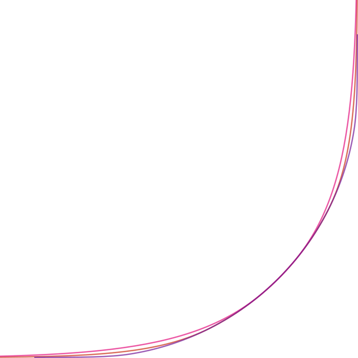

<h1 align="center">kurbo-smooth</h1>

    
     
    
    

A `squircle` generator for `kurbo`.

Squircles are common tools for achieving smooth curvatures and tend to replace rounded rectangles. This implementation is based on the excellent article [**Desperately seeking squircles**](https://www.figma.com/blog/desperately-seeking-squircles/) by Daniel Furse from figma which describes their approach for generating squircles.

At the end it results in an arc and two cubic bezier curves for ramp up. We further approximate the arc by two cubic curves to have a nice composite curve which can be used as building block for more complex paths.

Example curves with `0.2`, `0.6` and `0.9` smoothness.
## License

Licensed under either of

* Apache License, Version 2.0, ([LICENSE-APACHE](LICENSE-APACHE) or http://www.apache.org/licenses/LICENSE-2.0)
* MIT license ([LICENSE-MIT](LICENSE-MIT) or http://opensource.org/licenses/MIT)

at your option.

## Contribution

Unless you explicitly state otherwise, any Contribution intentionally submitted for inclusion in this crate by you, as defined in the Apache-2.0 license, shall be dual licensed as above, without any additional terms or conditions.
